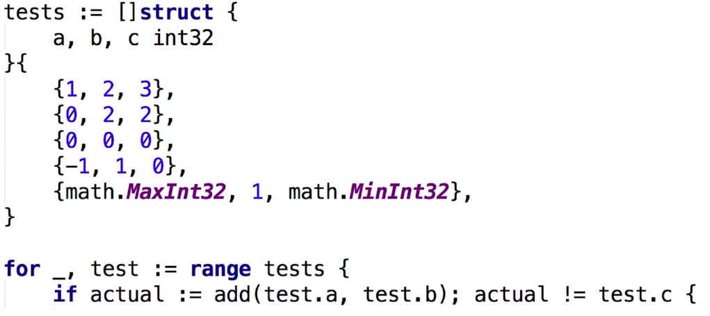
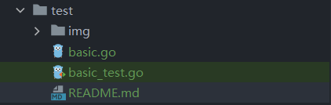
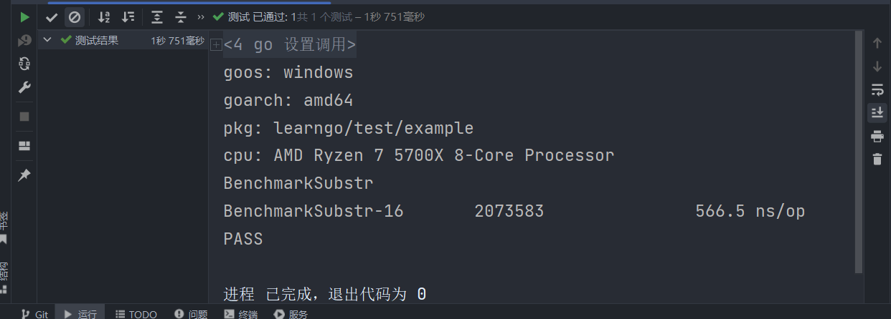
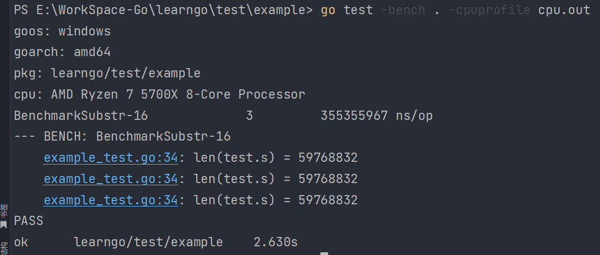
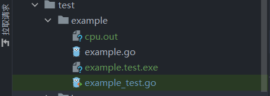
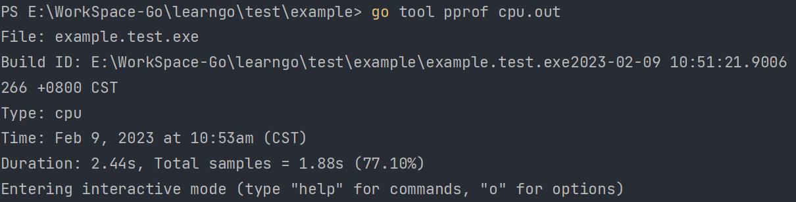
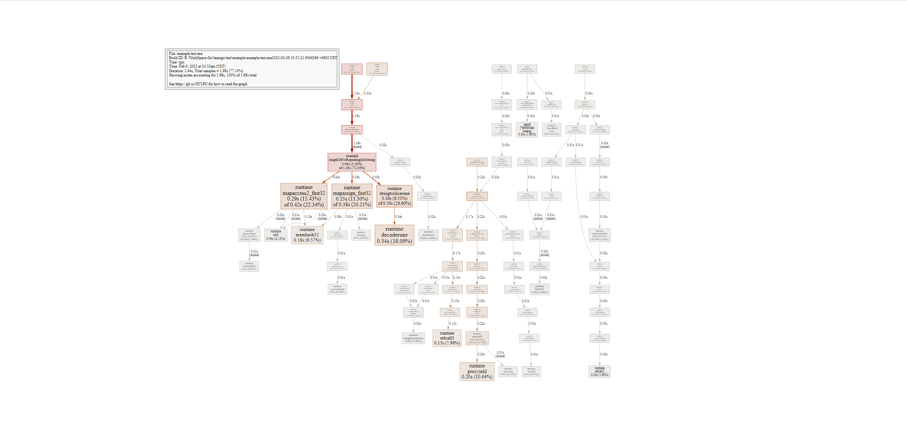

# 测试
## 表格驱动测试

- 分离的测试数据和测试逻辑
- 明确的出错信息
- 可以部分失败
- go语言的语法使得我们更容易实践表格驱动测试
```go
func TestTriangle(t *testing.T) {
	tests := []struct{ a, b, c int }{
		{3, 4, 5},
		{5, 12, 13},
		{8, 15, 17},
		{12, 35, 37},
		{12, 35, 39},
	}
	for _, test := range tests {
		if real := triangle(test.a, test.b); real != test.c {
			t.Errorf("triangle(%d, %d) = %d, want %d", test.a, test.b, real, test.c)

		}
	}
}
```
### 目录命名
测试文件必须命名为<font style="background:red">xxx_test.go</font>。编译器会自动识别为测试文件。


## 性能测试
```go
// 性能测试
func BenchmarkSubstr(b *testing.B) {
	test := struct {
		s    string
		want int
	}{
		"黑化肥挥发发灰会花飞化肥挥发发黑会飞花", 8,
	}
	for i := 0; i < b.N; i++ {
		if got := lengthOfNoRepeatingSubString(test.s); got != test.want {
			b.Errorf("lengthOfNoRepeatingSubString() = %v, want %v", got, test.want)
		}
	}

}

```

- 2073583：运行次数
- 566.5 ns/op：每次耗时566.5 ns
## 性能调优
在命令行运行如下命令
```go
go test -bench . -cpuprofile cpu.out
```


出现如下文件


在命令行运行如下命令
```go
go tool pprof cpu.out
```

在 https://graphviz.org/download/ 下载并安装，安装完成后在上图出现的命令行中输入`web`命令，则会出现下图：
方框越大，线越粗，花时间越多。

