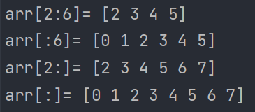
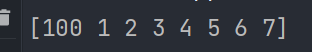
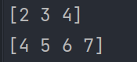
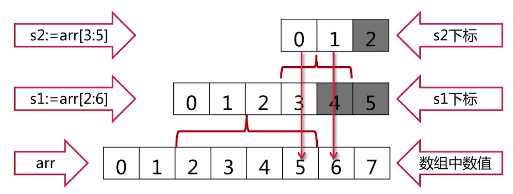
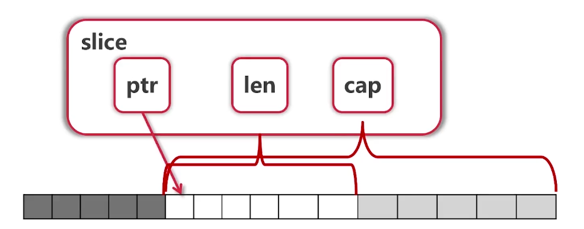
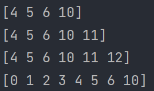

# 切片
## 使用
```go
arr := [...]int{0,1,2,3,4,5,6,7}
s := arr[2:6]
```
- s的值为[2 3 4 5],<font style="background:rgb(200,100,100)">左边包含，右边不包含。</font>
```go
func main() {
	arr := [...]int{0, 1, 2, 3, 4, 5, 6, 7}
	fmt.Println("arr[2:6]=", arr[2:6])
	fmt.Println("arr[:6]=", arr[:6])
	fmt.Println("arr[2:]=", arr[2:])
	fmt.Println("arr[:]=", arr[:])
}
```

## 通过切片修改数组的值
```go
func change(arr []int) {
	arr[0] = 100
}
func main() {
	arr := [...]int{0, 1, 2, 3, 4, 5, 6, 7}
	change(arr[:])
	fmt.Println(arr)
}
```

- Slice本身没有数据，是对底层array的一个view
- 对Slice修改会影响数组的值

## Reslice
```go
arr := [...]int{0, 1, 2, 3, 4, 5, 6, 7}
arr1 := arr[:5]
arr1 := arr1[:2]
```
## Slice扩展
```go
arr := [...]int{0, 1, 2, 3, 4, 5, 6, 7}
s1 := arr[2:5]
fmt.Println(s1)

s2 := s1[2:6]
fmt.Println(s2)
```

- 可以取到5，6，7


- ptr指向slice开始的地方
- len是slice的长度
- cap是用于扩展


- slice可以向后扩展，但是不可以超过原数组
- slice不可以向前扩展

## 向slice添加元素
```go
s3 := append(s2, 10)
fmt.Println(s3)
s4 := append(s3, 11)
fmt.Println(s4)
s5 := append(s4, 12)
fmt.Println(s5)
fmt.Println(arr)
```

- 添加元素时如果超越cap，系统会重新分配更大的底层数组
- 由于值传递的关系，必须接收append的返回值
- s=append(s,val)

## 创建Slice
```go
var s []int  //这种方式的切片值为nil
s1 := make([]int,16)  
s2 := make([]int,10,32)  //第一个参数表示len，第二个参数表示cap
```
## 拷贝Slice
```go
copy(s2,s1)  //将s1拷贝给s2
```
## 删除Slice某个元素
```go
//删除的元素下标为index
//...表示解构
s2=append(s2[:index],s2[:index+1]...)
```